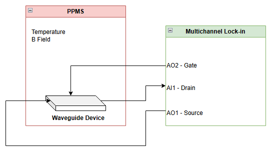

# Experiment Scripting

This project aims to build a platform for running scripted experiments in LevyLab. LevyLab utilizes an [Instrument Framework](https://github.com/levylabpitt/Instrument-Framework) to manage all instrumentation within the lab. Our goal is to create a system that scripts experiments, enabling communication with the Instrument Framework to perform customized experiments.

## Test Experiment

As a test case, we will use a [Simulated Waveguide](https://github.com/levylabpitt/Multichannel-Lockin?tab=readme-ov-file#waveguide-simulation). For data acquisition, we will employ the [Multichannel Lock-in](https://github.com/levylabpitt/Multichannel-Lockin) in simulation mode. For parameter control (Temperature and Magnetic Field), we will use the PPMS MultiVu in simulation mode.  


## Steps

1. Set up the Sandbox by following [these instructions](https://github.com/levylabpitt/Transport#sandbox).
2. Create a virtual environment and install the necessary requirements with:
   ```bash
   pip install -r requirements.txt

## Useful Links/References
[Instrument Framework - Port Numbers](https://github.com/levylabpitt/Instrument-Framework/wiki/Port-Numbers)
[Instrument Framework - APIs](https://github.com/levylabpitt/Instrument-Framework/wiki/Instrument-APIs)
[Instrument Framework - Remote Control](https://github.com/levylabpitt/Instrument-Framework/wiki/Remote-Control)


